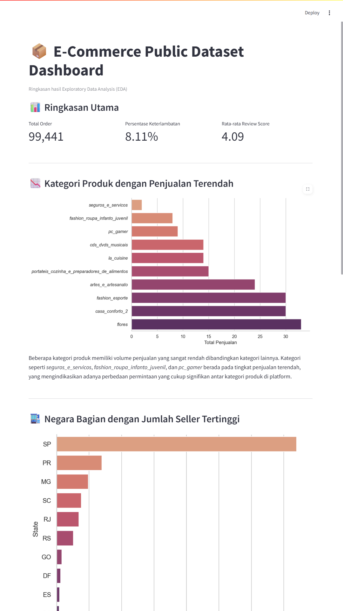
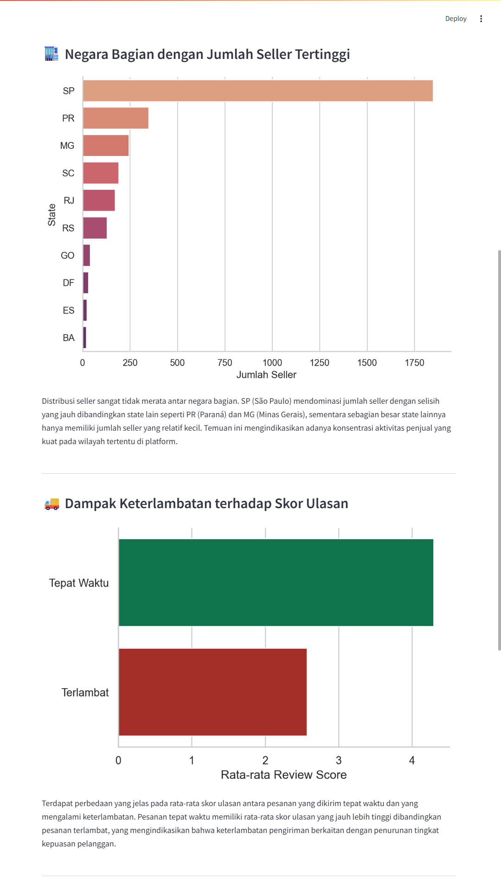
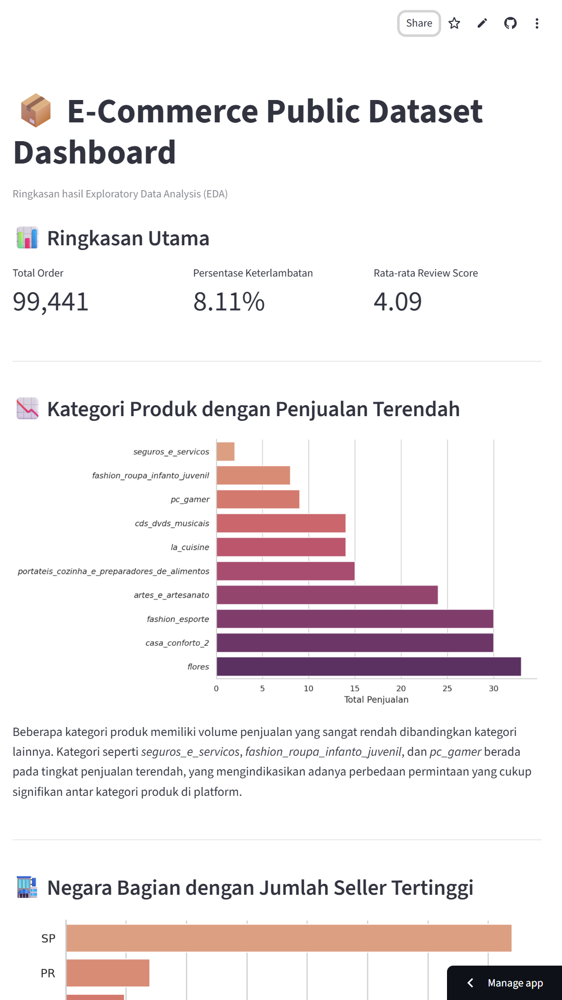

# E-Commerce Public Dataset Analysis Dashboard

## 📌 Deskripsi Proyek
Proyek ini bertujuan untuk melakukan analisis data pada *E-Commerce Public Dataset* guna memperoleh insight terkait performa penjualan produk, distribusi seller, serta pengaruh performa pengiriman terhadap kepuasan pelanggan.  
Hasil analisis disajikan melalui tahapan *Exploratory Data Analysis (EDA)* dan divisualisasikan dalam bentuk dashboard interaktif menggunakan **Streamlit**.

---

## 📂 Dataset yang Digunakan
Dataset yang digunakan merupakan **E-Commerce Public Dataset** dengan beberapa tabel utama, yaitu:
- `olist_orders_dataset.csv`
- `olist_order_items_dataset.csv`
- `olist_products_dataset.csv`
- `olist_customers_dataset.csv`
- `olist_sellers_dataset.csv`
- `olist_order_reviews_dataset.csv`

Dataset ini berisi informasi terkait pesanan, produk, pelanggan, seller, ulasan pelanggan, serta data waktu pengiriman.

---

## ⚙️ Cara Menjalankan Proyek
### 1. Clone Repository
```bash
git clone https://github.com/helenptrcia/ML_GDGOC.git
cd ML_GDGOC
```
### 2. Buat dan Aktifkan Virtual Environment
```bash
python -m venv .venv
```
Aktivasi (Windows): 
```bash
.venv\Scripts\activate
```
### 3. Install Dependency
```bash
pip install -r requirements.txt
```
### 4. Menjalankan Notebook (Opsional)
Notebook analisis dapat dijalankan menggunakan Jupyter Notebook atau Google Colab.

### 5. Menjalankan Dashboard
```bash
streamlit run app.py
```

Dashboard akan terbuka secara otomatis di browser.

## 📊 Ringkasan Insight Hasil Analisis
Beberapa insight utama yang diperoleh dari analisis data antara lain:
- Terdapat beberapa kategori produk dengan volume penjualan yang sangat rendah, menunjukkan perbedaan permintaan yang signifikan antar kategori produk.
- Distribusi seller sangat terkonsentrasi pada negara bagian São Paulo (SP), sementara state lain memiliki jumlah seller yang relatif lebih sedikit.
- Keterlambatan pengiriman berkaitan dengan penurunan skor ulasan pelanggan, yang mengindikasikan bahwa ketepatan waktu pengiriman berpengaruh terhadap kepuasan pelanggan.
- Rasio keterlambatan pengiriman bervariasi antar negara bagian, menunjukkan adanya perbedaan performa logistik antar wilayah.

## 🌐 Dashboard
Dashboard dikembangkan menggunakan Streamlit sebagai media penyampaian hasil analisis secara visual dan interaktif.
Dashboard dapat dijalankan secara lokal maupun dideploy dan diakses secara online melalui Streamlit Cloud.

## 📸 Screenshot

<p align="center">
  
  
  
</p>

